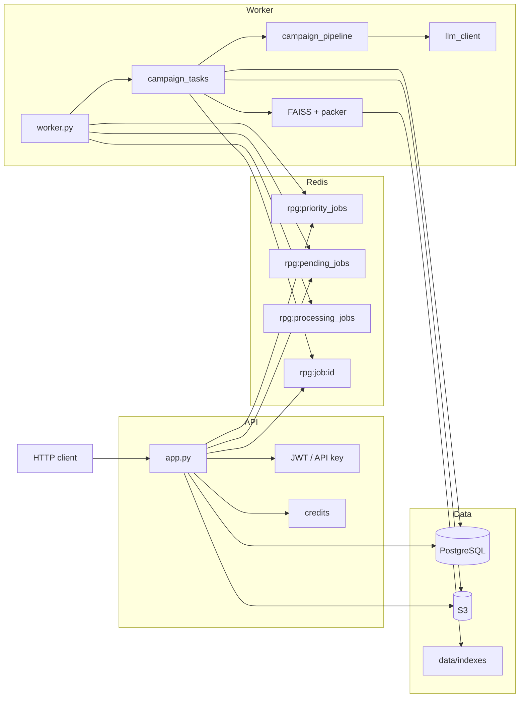

# 1. Architecture

[← Index](README.md) · [Next: Job →](02-job.md)

---

The API and the worker are separate processes. The API **never** calls the LLM on the HTTP request: it accepts the PDF, charges credits, uploads the file, and enqueues. The worker does the heavy work.

## Processes

| Process | Listens | Role |
|---|---|---|
| `app.py` (Flask / Gunicorn) | HTTP | Auth, validation, quota, S3, `RPUSH`, status |
| `worker.py` | Redis | `BRPOPLPUSH`, `process_campaign_generation`, ack, refund, cleanup |

Optional: GitHub Actions with `USE_GHA_WORKER=true` and `MAX_JOBS` (batch). Production should use a persistent worker.

## Diagram

> **Evidence (optional):** `docs/evidence/architecture-runtime.png`

## Redis queues

Constants in `services/queue_constants.py`. Reliable pattern:

1. API: `RPUSH` to `rpg:priority_jobs` (`pro` / `studio`) or `rpg:pending_jobs`.
2. Worker: `BRPOPLPUSH` priority first (1s timeout), then pending, onto `rpg:processing_jobs`.
3. Job end (success or failure): `LREM` from processing (ack).
4. State: hash `rpg:job:{uuid}` (+ result), default TTL **7 days**.

If the worker dies mid-job, the id stays on `processing` until manual intervention. There is no automatic reaper in-tree.

> **Evidence (optional):** `docs/evidence/redis-queues.png`

## Where data lives

| Store | Holds |
|---|---|
| PostgreSQL / SQLite | Users, jobs, credits, share slugs, billing |
| Redis | Queues + job status |
| S3 | Input PDF, sheets `sheets/{job_id}/pc_N.pdf`, output Markdown |
| Disk `RAG_INDEX_DIR` | `index.faiss`, `chunks.json`, meta per `book_id` |

With `S3_DELETE_INPUTS_AFTER_PROCESS=true` (default), the worker deletes the input PDF after processing.

## Code map

| Area | Paths |
|---|---|
| HTTP | `app.py`, `routes/dashboard.py`, `routes/billing.py`, `routes/rag.py` |
| Job | `worker.py`, `services/job_status.py`, `services/jobs_db.py` |
| Orchestration | `tasks/campaign_tasks.py` |
| Generation | `services/campaign_pipeline.py` |
| Plan / state | `services/campaign_schema.py` |
| Rubric | `services/campaign_eval.py` |
| Hard gate | `services/campaign_quality.py`, `services/campaign_normalize.py` |
| RAG | `services/rag/*` |
| LLM | `services/llm_client.py` |
| Auth / quota | `services/auth.py`, `services/quota.py` |
| Eval | `scripts/eval_reference_campaigns.py` |

## Decisions (short)

| Decision | Why |
|---|---|
| Split API and worker | Fast upload; generation may take minutes |
| `BRPOPLPUSH` queue | Job does not vanish if the worker dies mid-`POP` |
| FAISS on disk | Same book is not re-embedded every job |
| LLM via 9router | Local OpenAI-compatible gateway; models by complexity |

See also: [Job](02-job.md) · [RAG](03-rag.md) · [Operations](06-operations.md)

---

[← Index](README.md) · [Next: Job →](02-job.md)
