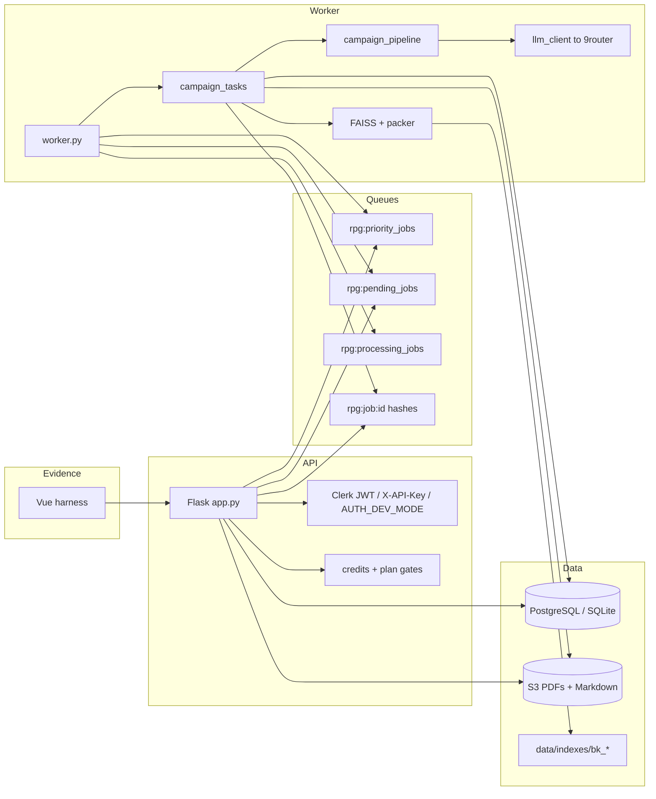

# 2. Architecture

## 2.1 Runtime processes

Two processes are required:

| Process | Listens to | Role |
|---|---|---|
| `app.py` (Flask / Gunicorn) | HTTP | Auth, PDF checks, quota, S3, enqueue, status |
| `worker.py` | Redis | Dequeue, `process_campaign_generation`, ack, mail, delete input |

Optional GitHub Actions batch worker (`USE_GHA_WORKER=true`, `MAX_JOBS`). Persistent worker is preferred.

## 2.2 Container view

> **Evidence — runtime diagram (optional PNG)**  
> Expected path: `docs/evidence/architecture-runtime.png`

## 2.3 Redis reliability pattern

1. API `RPUSH`es `rpg:priority_jobs` (pro/studio) or `rpg:pending_jobs`.
2. Worker `BRPOPLPUSH`es priority first (1s timeout), then pending, onto `rpg:processing_jobs`.
3. Terminal success/failure: `LREM` from processing (ack).
4. Job hash `rpg:job:{uuid}` (+ result hash), default TTL **7 days**.

Crash mid-job leaves the id on `processing`. There is **no** automatic reaper in-tree — operational risk.

> **Evidence — Redis queues**  
> Expected path: `docs/evidence/redis-queues.png`

## 2.4 Persistence

| Store | Holds |
|---|---|
| PostgreSQL / SQLite | Users, jobs, credit ledger, share slugs, billing |
| Redis | Queues + volatile job status |
| S3 | Input PDF, `sheets/{job_id}/pc_N.pdf`, output Markdown |
| `RAG_INDEX_DIR` | FAISS + `chunks.json` per `book_id` |

Default `S3_DELETE_INPUTS_AFTER_PROCESS=true`.

## 2.5 Code map

| Area | Paths |
|---|---|
| HTTP | `app.py`, `routes/dashboard.py`, `routes/billing.py`, `routes/rag.py` |
| Jobs | `worker.py`, `services/job_status.py`, `services/jobs_db.py` |
| Product pipeline | `tasks/campaign_tasks.py` → `services/campaign_pipeline.py` |
| Plan / state | `services/campaign_schema.py` |
| Rubric | `services/campaign_eval.py` |
| Structural gate | `services/campaign_quality.py`, `services/campaign_normalize.py` |
| RAG | `services/rag/*` |
| LLM | `services/llm_client.py` |
| Auth / quota | `services/auth.py`, `services/quota.py` |
| Offline eval | `scripts/eval_reference_campaigns.py` |

## 2.6 Frontend (out of core)

The Vue repo does not run RAG or the rubric. It only posts `/generate-campaign`, polls `/job-status/:id`, and renders Markdown / a presigned URL.

> **Evidence — UI progress**  
> Expected path: `docs/evidence/ui-progress.png`
