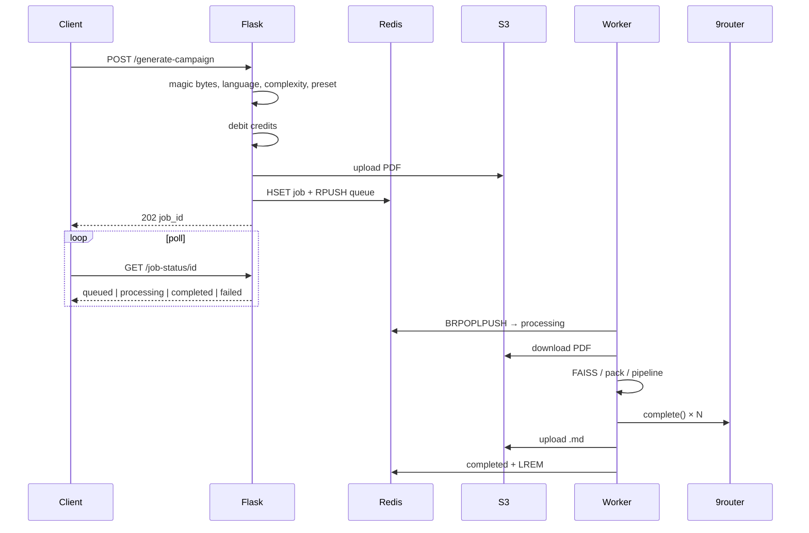

# 2. Job lifecycle

[← Architecture](01-architecture.md) · [Index](README.md) · [Next: RAG →](03-rag.md)

---

A **job** is one async unit: PDF + parameters → one Markdown (or failure with refund).

## Sequence

## Progress stages

From `PROGRESS_STAGES` in `tasks/campaign_tasks.py`:

| Key | % | Meaning |
|---|---|---|
| (API) | ~3 | `queued` — waiting for worker |
| `download` | 5 | Download PDF from S3 |
| `validate` | 10 | PDF pages |
| `fingerprint` | 18 | Identity / index |
| `extract` | 22 | Text (when applicable) |
| `sheets` | 28 | Character sheets |
| `analyze` | 40 | Pack RAG |
| `outline` | 55 | Plan / outline |
| `generate` | 75 | Write manuscript |
| `validate_out` | 90 | Structural quality |
| `upload` | 100 | Markdown on S3 |

> **Evidence (optional):** `docs/evidence/job-status-json.png` · `docs/evidence/worker-log.png`

## Inbound validation (API)

- `.pdf`, ≤ **50 MB**
- PDF magic bytes
- 1–**500** pages
- `complexity` ∈ {simples, mediana, complexa}
- Supported `target_language`
- Invalid `system_preset` → `generic`
- Sheets: `pro` / `studio` only; PDF; count ≤ party size (max 5)

## Credits

| Complexity | Cost |
|---|---|
| simples | 1 |
| mediana | 2 |
| complexa | 4 |

Free plan: `simples` only. Quota failure does not enqueue. Failure **after** debit → `refund_credits`. Pro/studio use the priority queue.

## Idempotency

`Idempotency-Key`: same user + key → existing `job_id`, no second charge.

## Success and failure

**Success:** normalized Markdown on S3, structural `quality_score` 0–100, rubric metadata on the result hash, optional Resend email, input deleted when configured.

**Failure:** `mark_failed`, refund, ack. Opaque HTTP errors when `FLASK_ENV=production`.

## Timings

The worker records per-phase milliseconds (`download_ms`, `fingerprint_ms`, `analyze_ms`, …) on job metadata.

See also: [API](05-api.md) · [Architecture](01-architecture.md) · [Operations](06-operations.md)

---

[← Architecture](01-architecture.md) · [Index](README.md) · [Next: RAG →](03-rag.md)
