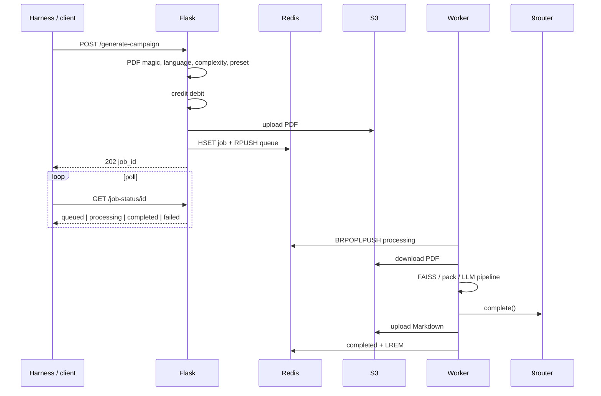

# 3. Job lifecycle

## 3.1 Sequence

## 3.2 Progress stages

From `PROGRESS_STAGES` in `tasks/campaign_tasks.py`: download 5% → validate 10% → fingerprint 18% → extract 22% → sheets 28% → analyze 40% → outline 55% → generate 75% → validate_out 90% → upload 100%. API sets `queued` ~3% before the worker starts.

## 3.3 Inbound validation

- `.pdf`, ≤ **50 MB**
- PDF magic bytes
- 1–**500** pages
- complexity / language / preset enums (bad preset → `generic`)
- Character sheets: pro/studio only; PDF; count ≤ party size (max 5)

## 3.4 Credits

| Complexity | Cost |
|---|---|
| simples | 1 |
| mediana | 2 |
| complexa | 4 |

Free plan: `simples` only. Quota failure does not enqueue. Worker `refund_credits` if generation fails after debit. Pro/studio use the priority queue.

## 3.5 Idempotency

`Idempotency-Key`: same user + key returns the existing `job_id` without a second charge.

## 3.6 Completion

Success: normalized Markdown on S3, structural `quality_score` 0–100, rubric blob on the result hash, optional Resend email, input deleted when configured.

Failure: `mark_failed`, refund, ack. Generic errors when `FLASK_ENV=production`.

> **Evidence — status JSON**  
> Expected path: `docs/evidence/job-status-json.png`

> **Evidence — worker log**  
> Expected path: `docs/evidence/worker-log.png`
