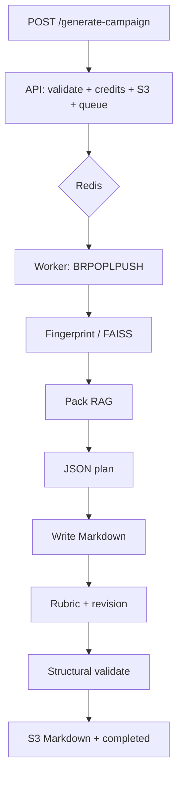

# RPG campaign generator — documentation

> **Start on this page.** In about five minutes you get the full backend flow. Links go to the details.

---

## What the system does

It accepts a **rulebook PDF**, indexes the text, builds a JSON campaign plan, writes Markdown (overview → sessions → appendix), scores the draft, and rewrites only weak sections. The HTTP client polls until the job finishes and downloads the Markdown.

The book is a **rules and tone reference**, not text to copy. Plot is invented to obey those procedures.

| Complexity | Idea |
|---|---|
| `simples` | 1–2 sessions, short arc, real choices |
| `mediana` | 3–4 sessions, subplot, cross-session consequences |
| `complexa` | 5–7 sessions, interlocking fronts, multiple endings |

---

## The flow (plain version)

Two processes: **API** (`app.py`) and **worker** (`worker.py`).

```
HTTP client
    │  POST /generate-campaign  (PDF + complexity + language + …)
    ▼
Flask API
    │  validate PDF · debit credits · upload PDF to S3 · enqueue Redis job
    │  respond 202 { job_id }
    ▼
Redis  (rpg:priority_jobs | rpg:pending_jobs)
    ▼
Worker
    │  1. download PDF from S3
    │  2. fingerprint → FAISS (reuse index if the book was seen before)
    │  3. RAG: retrieve excerpts (setting / mechanics / lore / theme)
    │  4. JSON plan (Campaign State) — names, factions, sessions, endings
    │  5. write overview + each session + appendix
    │  6. heuristic rubric → selective revision (up to 2 passes)
    │  7. structural validator (hard gate)
    │  8. upload Markdown to S3 · mark completed · ack queue
    ▼
HTTP client
       GET /job-status/{id}  until completed → .md URL
```



### Each stage in one line

| Stage | One sentence | Dig deeper |
|---|---|---|
| Enqueue | The API does not generate; it accepts the request and queues it. | [Job](02-job.md) · [API](05-api.md) |
| Fingerprint | The same PDF is not re-indexed; `book_id` = file hash. | [RAG](03-rag.md) |
| Pack RAG | Book excerpts become context; no usable chunks → job fails. | [RAG](03-rag.md) |
| JSON plan | All names are born here; writing only expands the plan. | [Pipeline](04-pipeline.md) |
| Writing | Overview → N sessions → appendix; every prompt gets the state digest. | [Pipeline](04-pipeline.md) |
| Rubric | 0–10 on 7 axes; overall ≥ 7.5 and nothing &lt; 6.0. | [Pipeline](04-pipeline.md) · [Evaluation](07-evaluation.md) |
| Hard gate | Headings, session count, word floor — fail → job does not pass. | [Pipeline](04-pipeline.md) |

---

## Index — when to open each chapter

| # | Chapter | Open when… |
|---|---|---|
| 1 | [Architecture](01-architecture.md) | You want processes, Redis queues, stores, file map |
| 2 | [Job lifecycle](02-job.md) | You want progress stages, credits, failures, idempotency |
| 3 | [RAG](03-rag.md) | You want fingerprint, chunks, lanes, token budgets |
| 4 | [Generation pipeline](04-pipeline.md) | You want plan → write → rubric → revise and why not multi-agent |
| 5 | [HTTP API](05-api.md) | You want contracts, auth, endpoints |
| 6 | [Operations](06-operations.md) | You want `.env`, CI, deploy, security |
| 7 | [Evaluation](07-evaluation.md) | You want the 4×3 matrix and what the metric actually measures |
| 8 | [Limits & roadmap](08-limits.md) | You want what is still unsolved |
| 9 | [Glossary](09-glossary.md) | You want a short definition |

Each chapter footer: **Previous · Index · Next**.

---

## Main pieces (quick reference)

| Piece | Path |
|---|---|
| API | `app.py`, `routes/` |
| Worker | `worker.py` |
| Job orchestration | `tasks/campaign_tasks.py` |
| Plan → write → revise | `services/campaign_pipeline.py` |
| Plan schema | `services/campaign_schema.py` |
| Rubric | `services/campaign_eval.py` |
| Structural validator | `services/campaign_quality.py` |
| RAG | `services/rag/` |
| LLM (9router) | `services/llm_client.py` |
| Offline eval | `scripts/eval_reference_campaigns.py` |

System presets: `generic`, `dnd5e`, `pf2e`, `coc`, `gurps`, `blood_honor`, `fragged`.

---

## Optional evidence

Diagrams, status JSON, logs, excerpts: drop into [`../evidence/`](../evidence/README.md). Chapters mark where each file fits.
