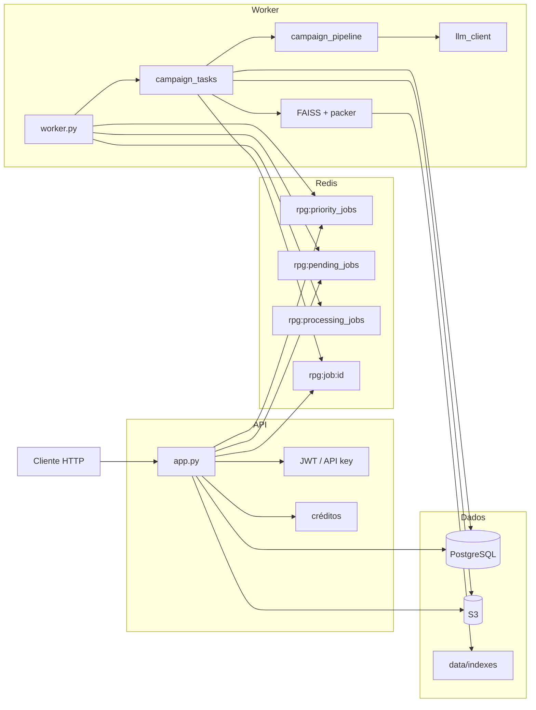

# 1. Arquitetura

[← Índice](README.md) · [Seguinte: Job →](02-job.md)

---

A API e o worker são processos separados. A API **nunca** chama o LLM no request HTTP: aceita o PDF, cobra créditos, sobe o ficheiro e enfileira. O worker faz o trabalho pesado.

## Processos

| Processo | Escuta | Função |
|---|---|---|
| `app.py` (Flask / Gunicorn) | HTTP | Auth, validação, quota, S3, `RPUSH`, status |
| `worker.py` | Redis | `BRPOPLPUSH`, `process_campaign_generation`, ack, refund, limpeza |

Modo opcional: GitHub Actions com `USE_GHA_WORKER=true` e `MAX_JOBS` (batch). Em produção o worker persistente é o caminho certo.

## Diagrama

> **Evidência (opcional):** `docs/evidence/architecture-runtime.png`

## Filas Redis

Constantes em `services/queue_constants.py`. Padrão fiável:

1. API: `RPUSH` em `rpg:priority_jobs` (planos `pro` / `studio`) ou `rpg:pending_jobs`.
2. Worker: `BRPOPLPUSH` da prioridade primeiro (timeout 1s), depois da pending, para `rpg:processing_jobs`.
3. Fim do job (sucesso ou falha): `LREM` em processing (ack).
4. Estado: hash `rpg:job:{uuid}` (+ result), TTL default **7 dias** (`JOB_STATUS_TTL`).

Se o worker morrer a meio, o `job_id` fica em `processing` até intervenção manual. Não há reaper automático no código.

> **Evidência (opcional):** `docs/evidence/redis-queues.png`

## Onde os dados vivem

| Store | Conteúdo |
|---|---|
| PostgreSQL / SQLite | Users, jobs, créditos, share slugs, billing |
| Redis | Filas + status do job |
| S3 | PDF de entrada, fichas `sheets/{job_id}/pc_N.pdf`, Markdown de saída |
| Disco `RAG_INDEX_DIR` | `index.faiss`, `chunks.json`, meta por `book_id` |

Com `S3_DELETE_INPUTS_AFTER_PROCESS=true` (default), o worker apaga o PDF de entrada após processar.

## Mapa de código

| Área | Paths |
|---|---|
| HTTP | `app.py`, `routes/dashboard.py`, `routes/billing.py`, `routes/rag.py` |
| Job | `worker.py`, `services/job_status.py`, `services/jobs_db.py` |
| Orquestração | `tasks/campaign_tasks.py` |
| Geração | `services/campaign_pipeline.py` |
| Plano / estado | `services/campaign_schema.py` |
| Rubrica | `services/campaign_eval.py` |
| Hard gate | `services/campaign_quality.py`, `services/campaign_normalize.py` |
| RAG | `services/rag/*` |
| LLM | `services/llm_client.py` |
| Auth / quota | `services/auth.py`, `services/quota.py` |
| Eval | `scripts/eval_reference_campaigns.py` |

## Decisões (resumo)

| Decisão | Motivo |
|---|---|
| API e worker separados | Upload rápido; geração pode demorar minutos |
| Fila com `BRPOPLPUSH` | Job não some se o worker cair no meio do `POP` |
| Índice FAISS no disco | Mesmo livro não é re-embedado a cada job |
| LLM via 9router | Gateway OpenAI-compatible local; modelos por complexidade |

Ver também: [Job](02-job.md) · [RAG](03-rag.md) · [Operação](06-operacao.md)

---

[← Índice](README.md) · [Seguinte: Job →](02-job.md)
