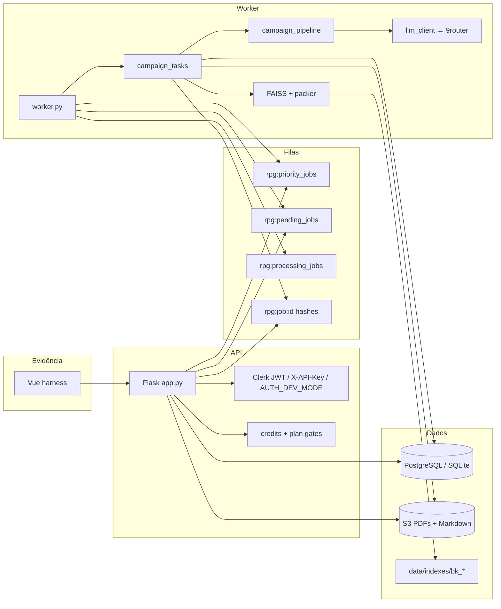

# 2. Arquitetura

## 2.1 Processos em runtime

Há **dois processos** obrigatórios em local e em produção:

| Processo | Entrada | Responsabilidade |
|---|---|---|
| `app.py` (Flask / Gunicorn) | HTTP | Auth, validação PDF, quota, S3, `RPUSH` na fila, status |
| `worker.py` | Redis | Tira job, corre `process_campaign_generation`, ack, email, apaga input S3 |

Opcional: workflow GHA (`USE_GHA_WORKER=true`) dispara o worker em batch (`MAX_JOBS`). O modo persistente é o recomendado.

## 2.2 Diagrama de contentores

> **Evidência — diagrama runtime (opcional PNG)**  
> Caminho esperado: `docs/evidence/architecture-runtime.png`

## 2.3 Filas Redis (padrão fiável)

Implementação: `worker.py` + `services/queue_constants.py`.

1. API faz `RPUSH` em `rpg:priority_jobs` (planos `pro` / `studio`) ou `rpg:pending_jobs` (restantes).
2. Worker `BRPOPLPUSH` **primeiro** da prioridade (timeout 1s), depois da pending, para `rpg:processing_jobs`.
3. Sucesso ou falha terminal: `LREM` em processing (ack).
4. Status do job: hash `rpg:job:{uuid}` (+ result hash), TTL default **7 dias** (`JOB_STATUS_TTL`).

Crash a meio: o id permanece em `processing` até intervenção. Não há reaper automático documentado no código — anota isto como risco operacional.

> **Evidência — filas Redis**  
> Caminho esperado: `docs/evidence/redis-queues.png`

## 2.4 Persistência

| Store | Conteúdo |
|---|---|
| PostgreSQL / SQLite | Users, jobs, transações de crédito, share slugs, billing |
| Redis | Filas + status volátil do job |
| S3 | PDF de entrada (`s3_key`), fichas `sheets/{job_id}/pc_N.pdf`, Markdown de saída |
| Disco `RAG_INDEX_DIR` | `index.faiss`, `chunks.json`, meta por `book_id` |

`S3_DELETE_INPUTS_AFTER_PROCESS=true` (default): o worker apaga o PDF de entrada após processar.

## 2.5 Mapa de código (backend)

| Área | Paths |
|---|---|
| HTTP | `app.py`, `routes/dashboard.py`, `routes/billing.py`, `routes/rag.py` |
| Job | `worker.py`, `services/job_status.py`, `services/jobs_db.py` |
| Pipeline de produto | `tasks/campaign_tasks.py` → `services/campaign_pipeline.py` |
| Plano / estado | `services/campaign_schema.py` |
| Rubrica | `services/campaign_eval.py` |
| Hard gate estrutural | `services/campaign_quality.py`, `services/campaign_normalize.py` |
| RAG | `services/rag/*` |
| LLM | `services/llm_client.py` |
| Auth / quota | `services/auth.py`, `services/quota.py` |
| Eval offline | `scripts/eval_reference_campaigns.py` |

## 2.6 Frontend (fora do núcleo)

O repositório Vue **não** implementa RAG nem a rubrica. Só:

1. `POST /generate-campaign` (multipart)
2. Poll `GET /job-status/:id`
3. Mostrar Markdown / URL pré-assinada

> **Evidência — UI progresso**  
> Caminho esperado: `docs/evidence/ui-progress.png`
