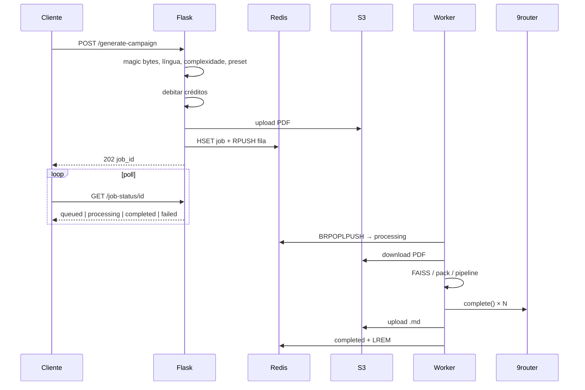

# 2. Ciclo de vida do job

[← Arquitetura](01-arquitetura.md) · [Índice](README.md) · [Seguinte: RAG →](03-rag.md)

---

Um **job** é uma unidade assíncrona: um PDF + parâmetros → um Markdown (ou falha com refund).

## Sequência

## Estágios de progresso

Definidos em `PROGRESS_STAGES` (`tasks/campaign_tasks.py`):

| Chave | % | Significado |
|---|---|---|
| (API) | ~3 | `queued` — à espera do worker |
| `download` | 5 | Baixar PDF do S3 |
| `validate` | 10 | Páginas do PDF |
| `fingerprint` | 18 | Identidade / índice |
| `extract` | 22 | Texto (quando aplicável) |
| `sheets` | 28 | Fichas de personagem |
| `analyze` | 40 | Pack RAG |
| `outline` | 55 | Plano / outline |
| `generate` | 75 | Escrita do manuscrito |
| `validate_out` | 90 | Qualidade estrutural |
| `upload` | 100 | Markdown no S3 |

> **Evidência (opcional):** `docs/evidence/job-status-json.png` · `docs/evidence/worker-log.png`

## Validação de entrada (API)

- Extensão `.pdf`, tamanho ≤ **50 MB**
- Magic bytes PDF
- 1–**500** páginas
- `complexity` ∈ {simples, mediana, complexa}
- `target_language` na lista suportada
- `system_preset` inválido → `generic`
- Fichas: só planos `pro` / `studio`; PDF; contagem ≤ party size (máx. 5)

## Créditos

`services/quota.py`:

| Complexidade | Custo |
|---|---|
| simples | 1 |
| mediana | 2 |
| complexa | 4 |

Plano `free` só gera `simples`. Sem créditos ou restrição de plano → **não** enfileira. Falha **depois** do debit → `refund_credits` no worker. Planos `pro` / `studio` usam a fila de prioridade.

## Idempotência

Header `Idempotency-Key`: mesmo utilizador + mesma chave → devolve o `job_id` existente sem novo débito.

## Sucesso e falha

**Sucesso:** Markdown normalizado no S3, `quality_score` 0–100 (validador estrutural), metadados da rubrica no result hash, email Resend se configurado, input S3 apagado se o flag estiver ligado.

**Falha:** `mark_failed`, refund, ack. Em `FLASK_ENV=production` as mensagens de erro HTTP são genéricas.

## Timings

O worker regista milissegundos por fase (`download_ms`, `fingerprint_ms`, `analyze_ms`, …) nos metadados do job — útil para diagnosticar lentidão em indexação vs LLM.

Ver também: [API](05-api.md) · [Arquitetura](01-arquitetura.md) · [Operação](06-operacao.md)

---

[← Arquitetura](01-arquitetura.md) · [Índice](README.md) · [Seguinte: RAG →](03-rag.md)
