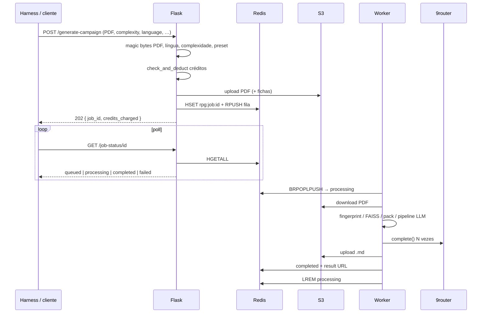

# 3. Ciclo de vida do job

## 3.1 Sequência

## 3.2 Estágios de progresso

`PROGRESS_STAGES` em `tasks/campaign_tasks.py`:

| Chave | % | Mensagem (EN, worker) |
|---|---|---|
| `download` | 5 | Downloading your rulebook... |
| `validate` | 10 | Validating PDF pages... |
| `fingerprint` | 18 | Fingerprinting your rulebook... |
| `extract` | 22 | Extracting text from PDF... |
| `sheets` | 28 | Reading character sheets... |
| `analyze` | 40 | Indexing and retrieving from your book... |
| `outline` | 55 | Building campaign outline... |
| `generate` | 75 | Weaving your campaign... |
| `validate_out` | 90 | Validating campaign quality... |
| `upload` | 100 | Saving your campaign... |

A API marca `queued` a ~3% antes do worker arrancar.

## 3.3 Validação de entrada

- Extensão `.pdf`, tamanho ≤ **50 MB** (`MAX_CONTENT_LENGTH`)
- Magic bytes PDF (`validate_pdf_magic_bytes`)
- Páginas: 1–**500** (`validate_pdf`)
- `complexity` ∈ {simples, mediana, complexa}
- `target_language` na lista suportada
- `system_preset` desconhecido → `generic`
- Fichas: só planos `pro` / `studio`; PDFs; contagem ≤ party size (máx. 5)

## 3.4 Créditos e planos

`services/quota.py`:

| Complexidade | Custo |
|---|---|
| simples | 1 |
| mediana | 2 |
| complexa | 4 |

Plano `free` só gera `simples`. Créditos insuficientes ou restrição de plano → **não** enfileira; ficheiros temporários apagados. Falha **depois** do deduct: worker chama `refund_credits`.

Planos `pro` / `studio` usam a fila de prioridade.

## 3.5 Idempotência

Header `Idempotency-Key`: se já existir job do mesmo utilizador com a chave, a API devolve o `job_id` existente (200) sem novo débito.

## 3.6 Conclusão e falha

**Sucesso:** Markdown normalizado no S3, `quality_score` 0–100 (validador estrutural), metadados da rubrica no result hash, email Resend se configurado, input S3 apagado se o flag estiver ligado.

**Falha:** `mark_failed`, refund, ack na processing queue. Mensagens genéricas se `FLASK_ENV=production`.

> **Evidência — JSON de status**  
> Caminho esperado: `docs/evidence/job-status-json.png`

> **Evidência — log do worker**  
> Caminho esperado: `docs/evidence/worker-log.png`
