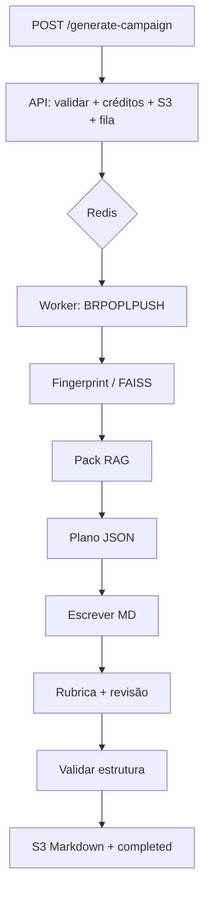

# Gerador de campanhas RPG — documentação

> **Comece nesta página.** Em ~5 minutos você entende o fluxo inteiro do backend. Os links levam aos detalhes.

---

## O que o sistema faz

Recebe um **PDF de regras**, indexa o texto, monta um plano de campanha em JSON, escreve o manuscrito em Markdown (visão geral → sessões → apêndice), pontua o resultado e reescreve só as seções fracas. O cliente HTTP faz poll até o job terminar e baixa o Markdown.

O livro é **referência de regras e tom**, não texto a copiar. O enredo é inventado para obedecer a esses procedimentos.

| Complexidade | Ideia |
|---|---|
| `simples` | 1–2 sessões, arco curto, escolhas reais |
| `mediana` | 3–4 sessões, subplot, consequências entre sessões |
| `complexa` | 5–7 sessões, frentes cruzadas, vários finais |

---

## O fluxo (versão direta)

Dois processos: **API** (`app.py`) e **worker** (`worker.py`).

```
Cliente HTTP
    │  POST /generate-campaign  (PDF + complexidade + idioma + …)
    ▼
API Flask
    │  valida PDF · debita créditos · sobe PDF ao S3 · enfileira job no Redis
    │  responde 202 { job_id }
    ▼
Redis  (rpg:priority_jobs | rpg:pending_jobs)
    ▼
Worker
    │  1. baixa PDF do S3
    │  2. fingerprint → FAISS (reusa índice se o livro já foi visto)
    │  3. RAG: recupera trechos (setting / mechanics / lore / theme)
    │  4. plano JSON (Campaign State) — nomes, facções, sessões, finais
    │  5. escreve overview + cada sessão + apêndice
    │  6. rubrica heurística → revisão seletiva (até 2 passes)
    │  7. validador estrutural (hard gate)
    │  8. sobe Markdown ao S3 · marca completed · ack na fila
    ▼
Cliente HTTP
       GET /job-status/{id}  até completed → URL do .md
```



### O que acontece em cada etapa (uma linha)

| Etapa | Em uma frase | Aprofundar |
|---|---|---|
| Enfileirar | A API não gera campanha; só aceita o pedido e coloca na fila. | [Job](02-job.md) · [API](05-api.md) |
| Fingerprint | O mesmo PDF não é reindexado; `book_id` = hash do ficheiro. | [RAG](03-rag.md) |
| Pack RAG | Trechos do livro viram contexto; sem chunks úteis o job falha. | [RAG](03-rag.md) |
| Plano JSON | Todos os nomes nascem aqui; a escrita só expande o plano. | [Pipeline](04-pipeline.md) |
| Escrita | Overview → N sessões → apêndice; cada prompt recebe o digest do estado. | [Pipeline](04-pipeline.md) |
| Rubrica | Score 0–10 em 7 eixos; overall ≥ 7,5 e nada &lt; 6,0. | [Pipeline](04-pipeline.md) · [Avaliação](07-avaliacao.md) |
| Hard gate | Headings, nº de sessões e mínimo de palavras — se falhar, o job não passa. | [Pipeline](04-pipeline.md) |

---

## Índice — quando abrir cada capítulo

| # | Capítulo | Abra quando… |
|---|---|---|
| 1 | [Arquitetura](01-arquitetura.md) | Quiser processos, filas Redis, stores e mapa de ficheiros |
| 2 | [Ciclo de vida do job](02-job.md) | Quiser estágios de progresso, créditos, falhas e idempotência |
| 3 | [RAG](03-rag.md) | Quiser fingerprint, chunks, lanes e orçamento de tokens |
| 4 | [Pipeline de geração](04-pipeline.md) | Quiser plano → escrita → rubrica → revisão e por que não multi-agente |
| 5 | [API HTTP](05-api.md) | Quiser contratos, auth e endpoints |
| 6 | [Operação](06-operacao.md) | Quiser `.env`, CI, deploy e segurança |
| 7 | [Avaliação](07-avaliacao.md) | Quiser a matriz 4×3 e o que a métrica mede de verdade |
| 8 | [Limites e roadmap](08-limites.md) | Quiser o que ainda não está resolvido |
| 9 | [Glossário](09-glossario.md) | Quiser a definição de um termo |

Navegação em cada capítulo: **Anterior · Índice · Seguinte** no rodapé.

---

## Peças principais (referência rápida)

| Peça | Ficheiro / pasta |
|---|---|
| API | `app.py`, `routes/` |
| Worker | `worker.py` |
| Orquestração do job | `tasks/campaign_tasks.py` |
| Plano → escrita → revisão | `services/campaign_pipeline.py` |
| Schema do plano | `services/campaign_schema.py` |
| Rubrica | `services/campaign_eval.py` |
| Validador estrutural | `services/campaign_quality.py` |
| RAG | `services/rag/` |
| LLM (9router) | `services/llm_client.py` |
| Eval offline | `scripts/eval_reference_campaigns.py` |

Presets de sistema: `generic`, `dnd5e`, `pf2e`, `coc`, `gurps`, `blood_honor`, `fragged`.

---

## Evidências opcionais

Diagramas, JSON de status, logs e excertos: coloque em [`../evidence/`](../evidence/README.md). Os capítulos marcam onde cada ficheiro encaixa.
